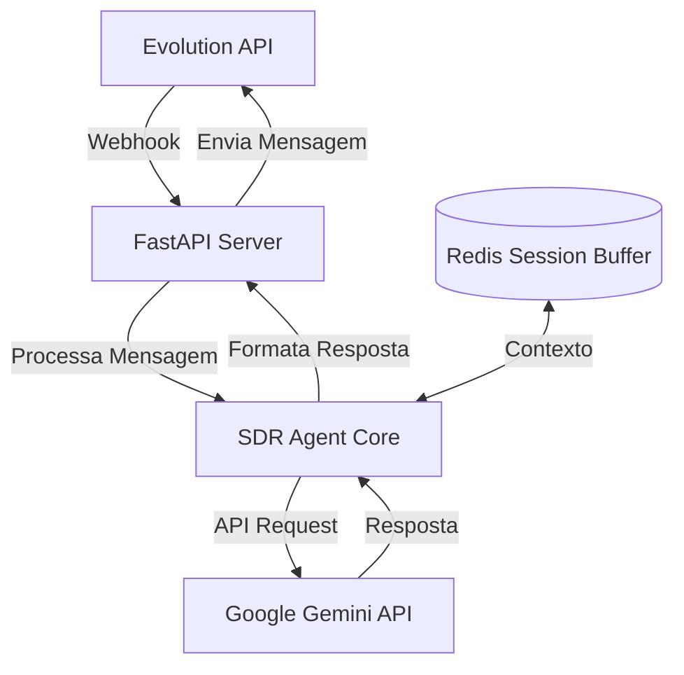
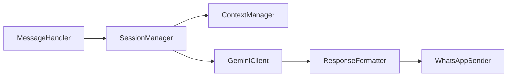
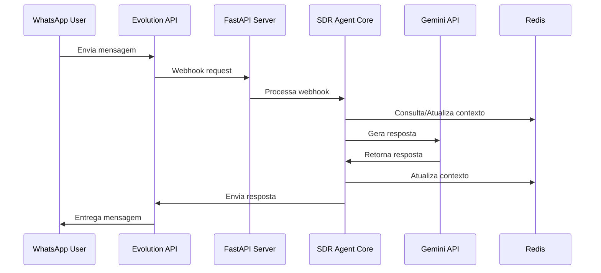

# Arquitetura do SDR Agent (Python-based)

## 1. Visão Geral do Sistema



## 2. Componentes Principais

### 2.1 Web Server (FastAPI)
- Endpoint para webhook da Evolution API
- Autenticação e validação de requests
- Rotas para gerenciamento e monitoramento
- Interface assíncrona para melhor performance

### 2.2 SDR Agent Core


#### Componentes:
1. **MessageHandler**
```python
class MessageHandler:
    async def process_message(self, webhook_data: WebhookData) -> None:
        # Extrai dados relevantes
        # Valida e normaliza input
        # Encaminha para SessionManager
```

2. **SessionManager**
```python
class SessionManager:
    def __init__(self, redis_client: Redis):
        self.redis = redis_client
        self.context_manager = ContextManager()
    
    async def handle_conversation(self, user_id: str, message: str) -> str:
        # Gerencia estado da conversa
        # Coordena fluxo entre componentes
```

3. **ContextManager**
```python
class ContextManager:
    async def update_context(self, user_id: str, message: str) -> None:
        # Mantém histórico de conversa
        # Implementa janela deslizante de contexto
        # Gerencia expiração de sessões
```

4. **GeminiClient**
```python
class GeminiClient:
    async def generate_response(self, 
                              prompt: str, 
                              context: str) -> str:
        # Integração com Google Gemini API
        # Gerenciamento de prompts
        # Rate limiting e retry
```

5. **ResponseFormatter**
```python
class ResponseFormatter:
    def format_response(self, 
                       response: str, 
                       message_type: str) -> str:
        # Formata resposta para WhatsApp
        # Aplica regras de formatação
        # Divide mensagens longas se necessário
```

6. **WhatsAppSender**
```python
class WhatsAppSender:
    async def send_message(self, 
                          number: str, 
                          message: str) -> bool:
        # Integração com Evolution API
        # Gerenciamento de erros e retry
        # Confirmação de envio
```

## 3. Fluxo de Dados



## 4. Estrutura do Projeto

```
sdr-agent/
├── src/
│   ├── config/
│   │   ├── settings.py      # Configurações do projeto
│   │   └── prompts.py       # Templates de prompts
│   ├── core/
│   │   ├── message.py       # MessageHandler
│   │   ├── session.py       # SessionManager
│   │   ├── context.py       # ContextManager
│   │   ├── gemini.py        # GeminiClient
│   │   └── whatsapp.py      # WhatsAppSender
│   ├── api/
│   │   ├── routes.py        # FastAPI routes
│   │   └── models.py        # Pydantic models
│   ├── utils/
│   │   ├── logger.py        # Logging
│   │   └── validators.py    # Validações
│   └── types/
│       └── schemas.py       # Type definitions
├── tests/
├── requirements.txt
└── docker-compose.yml
```

## 5. Tecnologias

1. **Core:**
   - Python 3.11+
   - FastAPI
   - Redis
   - Pydantic
   - httpx

2. **APIs:**
   - Google Gemini API
   - Evolution API

3. **Monitoramento:**
   - Prometheus
   - Grafana

## 6. Implementação

### 6.1 Configuração
```python
# settings.py
from pydantic_settings import BaseSettings

class Settings(BaseSettings):
    GEMINI_API_KEY: str
    EVOLUTION_API_URL: str
    REDIS_URL: str
    WEBHOOK_SECRET: str
    SESSION_TIMEOUT: int = 3600
    
    class Config:
        env_file = ".env"
```

### 6.2 Exemplo de Endpoint
```python
# routes.py
from fastapi import FastAPI, HTTPException, Depends
from .models import WebhookData

app = FastAPI()
message_handler = MessageHandler()

@app.post("/webhook")
async def handle_webhook(data: WebhookData):
    try:
        await message_handler.process_message(data)
        return {"status": "success"}
    except Exception as e:
        raise HTTPException(status_code=500, detail=str(e))
```

## 7. Considerações

### 7.1 Segurança
- Validação de webhooks com HMAC
- Rate limiting por IP/usuário
- Sanitização de inputs
- Variáveis de ambiente seguras

### 7.2 Performance
- Processamento assíncrono
- Cache de respostas comuns
- Otimização de contexto
- Connection pooling

### 7.3 Monitoramento
- Métricas de latência
- Taxa de sucesso de requests
- Uso de memória/CPU
- Alertas automáticos

### 7.4 Escalabilidade
- Containerização com Docker
- Balanceamento de carga
- Replicação de Redis
- Auto-scaling baseado em métricas